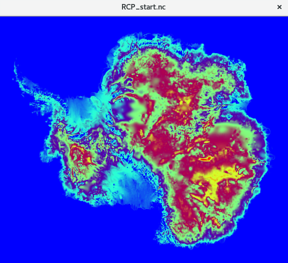

# DeepIceSheetDS2.5

**Downscaling ice-thickness maps using SRCNN(super resolution based on Deep Neural Networks)**

This is the first step of my internship work in the Antarctic Research Centre (Victoria University of Wellington,
 New-Zealand).
I followed the idea of processing Ice Thickness maps (thk) as pictures, applying them
Deep Leaning(DL) SRCNN methods, inspired and helped by T. Vandal paper on DeepSD (https://arxiv.org/abs/1703.03126). 
My model implementation in Python3 of SRCNN using Tensorflow has been inspired by GitHub user 
tegg89 repository(https://github.com/tegg89/SRCNN-Tensorflow).

## Methodology
I have an Antarctic thk [dataset](/data/RCP_start.nc) with a 5km resolution. This dataset also contains 
topography and surface's nature.

. 

The main idea is to upscale data to a s * 5km map -where s is the scale factor multiple of 2- train the model with s * 5km 
inputs and 5km label, and tune it to get results as good as possible. The Deep Learning library used is Tensorflow.
## Data Preparation 

[PyFile](ncProcessing.py)

I "cutted" in the 5km Antarctic map to extract a rectangle of 820x410 measures, x axe from -1741591m to 2356950m and y axe from -915923m
to 1131135m, with a south polar stereographic projection, with a latitude of true scale at -71.
Then I cutted this rectangle once more, generating 200 41x41 "pictures" of thk (with their coordinates in another channel of the matrix).
This 200 41x41 5km pictures will be the __labels__ for the model. I copied them and downscaled the copy to 200 20x20 pictures, 
and then upscale them using simple bicubic interpolation to 200 41*41 now 10km pictures, which will be the __inputs data__ for the model.
Endly I splitted both labels and data using Scikit-learn toolkit into a 140 (inputs, label) training set and 60 (inputs, label)  testing set.

## Model : recurrent-SRCNN 

 **for dowscaling >2x**, the program can be called a **recurrent-SRCNN**, meaning that, for downscaling 4x, the LR map
 will be first downscaled 2x with a 2x downscaled label, and then the 2x downscaled prediction will be downcaled another
 2x with the original label.
 The main model I use is a Deep Convolutional Neural Network described in this [paper](https://arxiv.org/abs/1501.00092v3) by Chao Dong. 
Loss function is Mean Squared Error and the optimizer is Adam Optimizer. 

## Results

**4x dowscaling** (100000 epochs, learning rate 1e-6): bicubic  RMSE error : 2.6e-4, model : 1.18e-4

**8x downscaling** (30000 epochs, learning rate 1e-4): bicubic RMSE error : 1.6e-2, model : 7.1e-4

**16x downscaling** (30000 epochs, learning rate 1e-4): bicubic RMSE error : 3.6e-3, model : 1.1e-3

Both bicubic, model and label plots can be seen in these repositories : 

[4x downscaling](/x4_results_30000_e4)

[8x downscaling](/x8_results_30000_e4)

[16x downscaling](x16_results_30000_e4)

## Issues encountered 

Build this recurrent SRCNN using Tensorflow asked me more than 1 week of work from the initial one-step (suited to ice-thk problem)
SRCNN, from understanding how setting outputs
from the first 2x dowscaling step as the input of the next step to reduce the computation complexity. Indeed the first 
runs of the model, the computation time was more than 20 seconds for 10 epochs, and I realized then that the more advanced 
epoch it was, the more time it will last. I understood that my algorithm was not optimized because I added new nodes to the 
graph at each epoch. These problem were solved by defining variables, models, layers outside of the training loop, with 
a massive use of dictionaries.   